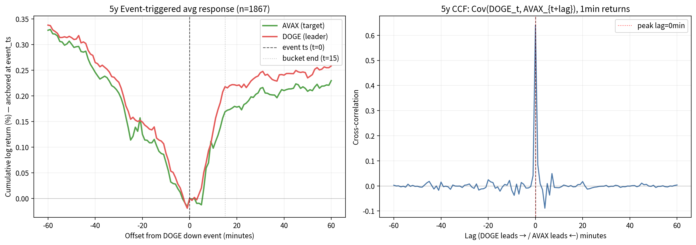

# 암호화폐 허딩 연구 — 선행연구 비교 발표

**발표 구성:**
1. 선행연구 설명
2. 선행연구와 내 연구 비교
3. 내 연구에서의 결론과 확장 방향

---

# Part 1 — 선행연구 설명

---

## 발표 주제

오늘 발표할 주제는 암호화폐 시장의 **허딩(herding) 현상**입니다. 허딩이라는 건 시장 참여자들이 자기 판단보다 다른 사람들의 움직임을 따라가면서 가격이 한쪽으로 쏠리는 현상을 말합니다.

---

## 선행연구 소개

제가 참고한 논문은 다음과 같습니다.

> **"Herding, information cascades, and cryptocurrencies — New evidence using low frequency and high frequency data"**

이 논문이 출발하는 문제의식은 의외로 단순합니다. 그동안 암호화폐 시장의 herding을 다룬 연구들이 결론을 일관되게 내리지 못했다는 점입니다. 어떤 연구는 herding이 있다고 하고, 어떤 연구는 없다고 하는데, 저자들은 이 차이가 **데이터 빈도와 방법론의 한계** 때문이라고 봅니다.

특히 기존에 가장 많이 쓰던 **CSAD 방식**이 CAPM 가정을 깔고 있는데, 암호화폐는 가격결정모형 자체가 불안정하기 때문에 이 가정이 잘 맞지 않습니다. 그래서 이 논문은 CSAD 하나만 쓰지 않고, 여러 도구를 같이 사용해서 다층적으로 herding을 측정합니다.

### 데이터

- **저빈도 데이터**: CoinMarketCap의 62개 코인, 일·주간 가격, 2018-01부터 2024-04까지
- **고빈도 데이터**: Bitstamp의 BCH/BTC/ETH/LTC/XRP 5개 코인, tick-by-tick 자료, 약 1억 1226만 건의 거래
- 시기는 pre-COVID, COVID-19, post-COVID로 나누어 비교

### 방법론 — 다층 도구

| 도구 | 측정 대상 |
|---|---|
| CSAD (전통) | 기본 herding |
| **SCSAD** (Wang-Hudson) | 수정된 herding |
| **GJR-GARCH** | 변동성 비대칭 |
| **Idiosyncratic vol grouping** | 자산별 고유 변동성으로 그룹화 |
| **Patterson-Sharma intensity** | tick-level intraday herding |
| **VPIN** | informed trading proxy |
| **SUR 모형** | herding × informed trading 관계 |

핵심은 단일 도구가 아니라 이 도구들을 모두 **같이 사용해서 herding을 입체적으로 측정**한다는 점입니다.

---

## 선행연구 핵심 결과

이 논문이 발견한 결과는 네 가지로 정리할 수 있습니다.

### 1. 단순 CSAD로는 herding이 잘 안 잡힌다 — SCSAD를 써야 한다

전통적인 CSAD만 쓰면 암호화폐 시장에서 herding이 약하게 나오거나 안 나오지만, 수정된 **SCSAD 방식**을 적용하니까 전체 기간뿐 아니라 pre-COVID, COVID, post-COVID 모든 구간에서 herding이 유의하게 잡힙니다. 즉 도구를 바꾸면 결론이 바뀝니다.

### 2. 저변동성·침체장에서 herding이 더 강하다 (직관과 반대)

흔히 시장이 불안하고 변동성이 클 때 사람들이 더 몰려다닐 거라고 생각하는데, 이 논문은 정반대입니다. **저변동성 구간, 특히 post-COVID Crypto Winter (2022-2023)** 시기에 herding이 가장 강하게 나타났습니다. 자산별 고유 변동성으로 봤을 때도 마찬가지로 저~중간 변동성 그룹에서 herding이 뚜렷했습니다.

저자들은 이를 "조용하지만 불확실한 시장"에서 투자자들이 자기 판단을 약하게 가져가고 시장 컨센서스를 더 따르기 때문이라고 해석합니다.

### 3. Intraday tick herding은 대형 코인에서 강하다

고빈도 tick 분석에서는 가격이 같은 방향으로 연속되는 run(run-based intensity)을 봤더니, BTC, ETH, XRP 같은 대형 코인에서 같은 방향 거래가 길게 이어지는 패턴이 확인됐습니다.

### 4. Information cascade — 논문의 핵심 기여

가장 중요한 기여는 정보 캐스케이드 분석입니다. **VPIN**으로 "정보 우위가 있는 트레이더의 거래 비중"을 추정하고, **SUR 모형**으로 herding과 informed trading의 관계를 분석합니다.

여기서 흥미로운 건 informed traders의 **이중적 역할**입니다.

- 시장에 뚜렷한 방향성이 있을 때(상승/하락 추세) → informed traders는 herding을 **강화**합니다 (orchestrator 역할)
- 가격이 거의 안 움직이는 zero-tick 정체 상태 → informed traders는 herding을 **안정화**합니다

특히 Bitcoin은 안정화 효과가 강했고, 다른 코인들은 herding을 악화시키는 경향이 더 컸습니다.

### 한 줄 요약

> "암호화폐 herding은 비이성적 군중심리가 아니라, **시장 상태와 정보 우위 트레이더의 전략에 따라 달라지는 동적 현상**이다."

---

# Part 2 — 선행연구와 내 연구 비교

---

## 데이터·방법론 비교

### 데이터 차이

| 항목 | 선행연구 | **내 연구** |
|---|---|---|
| 자산 | 62개 (저빈도) / 5개 (고빈도) | **14개 USDT (BTC/ETH/XRP/SOL/DOGE/ADA/AVAX 등)** |
| 거래소 | CoinMarketCap, Bitstamp | **Binance** |
| 기간 | 2018-2024 (6년) | **2021-2026 (5년 tick) + 2024-2026 (2년 1분봉)** |
| 시기 구분 | pre/COVID/post-COVID | bull / winter / recovery / current |

자산 universe는 비슷한 규모이지만 거래소가 다르고, 기간은 제 연구가 좀 더 최근 자료에 집중되어 있습니다.

### 도구 매핑 — 두 트랙이 거의 직교

| 도구 | 선행연구 | **연구** |
|---|---|---|
| CSAD (단순) | ✅ | ✅ baseline |
| SCSAD | ✅ | ✅ paper-like 주간 |
| GJR-GARCH | ✅ | ❌ |
| **Vol regime split** | ✅ | ✅  |
| Idiosyncratic vol grouping | ✅ | ❌ |
| Tick intraday herding | ✅ Patterson-Sharma | ✅ 15-min event study |
| **VPIN** (informed trading) | ✅ | ❌ |
| **SUR 모형** | ✅ | ❌ |
| **Lead-lag matrix (자산 간 directed)** | ❌ | ✅ |
| Cointegration 통합 (sprint1) | ❌ | ✅  |

여기서 중요한 점은 **두 연구가 거의 직교한 도구들을 쓴다**는 것입니다. 선행연구는 informed trading을 측정하는 VPIN과 SUR 모형 쪽으로 깊이 갔고, 제 연구는 자산 사이의 directional lead-lag matrix 쪽으로 갔습니다. 두 트랙이 보는 axis가 거의 겹치지 않습니다.

---

## 결과 비교 

두 연구 간의 차이가 보완적인 결과를 보였습니다. 

### 1. Vol regime — 정반대 결과

| | 선행연구 | **내 연구** |
|---|---|---|
| 어디서 herding이 강한가? | **저변동성** | **고변동성** |
| 예시 | post-COVID winter (2022) | 2023-2024 recovery |
| Top edge: DOGE down → AVAX | — | low vol t=2.06 / **high vol t=2.76** |

선행연구는 변동성이 낮을 때 herding이 강하다고 말하는데, 실제 진행한 데이터에서는 정반대로 변동성이 높을 때 더 강했습니다.

### 2. 시기별 강도

| Period | 선행연구 (CSAD) | **내 연구 (lead-lag matrix)** |
|---|---|---|
| 2021 bull / 2022 winter | 강함 (논문 주장) | 약함 (\|t\|≥2.0: 7/84) |
| 2023-2024 recovery | — | **가장 강함** (\|t\|≥2.0: 9/84) |
| 2024-2026 current | — | 약화 (3/84) |

시기별로 봐도 마찬가지입니다. 선행연구는 2022 Crypto Winter 시기에 강하다고 했는데, 제 매트릭스는 2023-2024 회복 시기에 가장 강하게 나옵니다.

### 차이의 해석 — 모순이 아니라 보완

처음에는 이 차이가 모순처럼 보였는데, 자세히 들여다보니 **두 연구가 측정하는 herding의 종류 자체가 다릅니다**.

| | 선행연구 | **내 연구** |
|---|---|---|
| 측정 대상 | 시장 전체 dispersion 압축 (CSAD) | 자산 간 동시 반응 (lead-lag matrix) |
| 트리거 | 정보 흐름 약함 → 컨센서스 따라감 | macro shock → 알트 공동 반응 |
| 시간 scale | 일·주간 | 15-min bucket |
| 핵심 발견 | "조용한 컨센서스 herding" | "macro shock 후 알트 공동 mean reversion" |

선행연구가 본 herding은 시장이 조용할 때 자산들이 시장 평균에서 덜 벗어나는, 즉 **dispersion이 압축**되는 현상입니다. 반면 제가 본 herding은 큰 충격이 일어났을 때 알트들이 **동시에 같은 방향으로 움직이는** 현상입니다. 측정하는 시간 scale도, 측정하는 차원도 다르기 때문에 어느 쪽이 맞다 틀리다가 아니라 **같은 시장의 다른 면을 본 보완적인 결과**로 봐야 합니다.

---

# Part 3 — 내 연구의 결론과 확장 방향

---

## 연구의 결론

### 살아남은 발견

5년 데이터로 lead-lag matrix를 만들고, 다중비교 보정 같은 robustness 검증을 거쳐도 살아남은 패턴이 있습니다.

바로 **DOGE의 down event 후에 알트들이 공동으로 mean reversion하는 패턴**입니다.

- BH-FDR q=0.05 보정 통과 — 2개 cell (DOGE down → AVAX, ADA)
- 5년 평균 t=3.42 (DOGE → AVAX), effect size +0.058% / 30분
- 2023-2024 recovery 시기 + 고변동성에서 가장 강함

이 정도면 통계적으로는 진짜 살아있는 신호라고 할 만합니다.

### 단, 결정적 한계 — Tick-level CCF 결과

**Tick-level CCF 그림:**

이 그림이 핵심입니다. 왼쪽을 보면 DOGE event 직후 AVAX와 DOGE의 평균 가격이 **거의 완벽히 겹치며** 같이 떨어졌다가 같이 반등합니다. AVAX가 30분간 +0.21% 오를 때 DOGE 자기도 +0.25%로 같이 반등합니다. 즉 AVAX가 DOGE를 "따라가는" 게 아니라 **둘이 동시에 같이 움직입니다**.

오른쪽 cross-correlation function을 보면 더 분명합니다. 두 자산의 1분 단위 returns의 상관관계가 **lag = 0에서 peak**를 찍습니다. ±1분에서는 상관이 0.04~0.08로 급격히 작아집니다. 즉 시간차가 거의 0이라는 뜻입니다.

이 결과의 함의는 명확합니다. 통계적으로 "DOGE → AVAX"라고 부를 수 있는 패턴은 있지만, 시간적인 의미에서 DOGE가 먼저 움직이고 AVAX가 따라가는 게 아닙니다. 동시 반응입니다. 그래서 **이 신호로 latency 게임 외에는 alpha 트레이딩 신호로 변환할 수 없습니다**. 이건 alpha라기보다는 beta 구조에 가깝습니다.

### 죽은 가설들

이 1년 동안 검증을 거친 결과, 죽었다고 말할 수 있는 가설들은 다음과 같습니다.

- 광범위 허딩 (β2 = +4.53, 105만 obs로 명확히 기각)
- BTC/ETH 알트 일반화 (이 두 자산은 알트 패턴 안 따라감)
- News/Reddit standalone alpha (텍스트 단독 신호 weak)
- 시간적 lead-lag (CCF lag=0 결과)
- Cointegration × lead-lag 단순 결합 (permutation p=0.208)

### 한 줄 결론

> **광범위 허딩은 죽었지만, "macro shock 후 알트 공동 mean reversion" 패턴은 통계적으로 살아있다. 단 동시 반응이라 alpha라기보단 beta 구조. 선행연구의 "저변동성 컨센서스 herding"과 보완적인 다른 종류의 herding을 측정한 셈.**

---

## 확장 방향

연구를 더 발전시킬 수 있는 길을 우선순위로 정리하면 세 가지입니다.

### A. 선행연구 framework 통합 (가장 우선)

지금 제 연구는 lead-lag matrix를 새로 추가했지만, 선행연구가 깊이 들어간 informed trading 측면은 거의 다루지 않았습니다. 두 framework를 통합하면 가장 큰 효과를 얻을 수 있습니다.

| 도구 | 통합 가능성 |
|---|---|
| **VPIN** (informed trading proxy) | aggTrades에서 직접 계산 가능. 우리 lead-lag와 결합 |
| **SUR 모형** | "lead-lag가 informed trading에 driving되는가" 결판 |
| **Idiosyncratic vol grouping** | 자산별 고유 변동성으로 그룹별 매트릭스 재계산 |
| **GJR-GARCH** | 변동성 비대칭 모델링 |
| **Zero-tick state 분석** | 정체 상태에서 informed traders의 안정화 효과 |

특히 VPIN과 SUR 모형이 핵심입니다. 이 두 도구를 적용하면 **"본 공동 반응이 informed traders에 의해 driving되는가, 아니면 단순 noise herding인가"**를 결판할 수 있습니다. 이게 가장 명확한 다음 단계입니다.

### B. 살아있는 신호 정밀화

지금 발견한 패턴이 왜 시기에 따라 다른지를 더 파고들 필요가 있습니다.

- **Recovery vs current regime 분해**: 왜 2023-2024 recovery에 강하고 2024-2026 current에 약화되는가
- **Lag=0 동시 반응의 trade 변환 가능성**: latency가 매우 낮은 환경에서는 활용 가능할까

### C. 새 정보축 추가

같은 OHLCV에서 hyperparameter를 더 튜닝하는 건 의미가 없을 것 같습니다. 대신 새로운 정보 source를 추가해야 합니다.

- **Funding rate / Perp-spot basis**: leverage cascade 선행 가능성
- **Cross-exchange spillover**: Coinbase, OKX 같은 다른 거래소와의 spread
- **On-chain flow**: 거래소 inflow/outflow

### 한 줄 정리

> **이번 연구는 "lead-lag matrix"라는 새로운 측면을 더했고, 다음에는 선행연구의 informed trading framework와 통합해서 "이 공동 반응을 누가 만드는가"를 결판할 차례입니다.**

## 참고 — 상세 자료 위치

- 상세 발표 자료: `outputs/presentation_2026-05-08.md`
- 5년 Lead-lag matrix: `outputs/tick/multi_asset_5y/lead_lag_matrix/`
- Robustness 검증: `experiments/lead_lag_robustness/outputs/`
- Cointegration 통합: `experiments/cointegration_lead_lag/outputs/`
